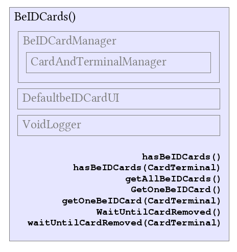
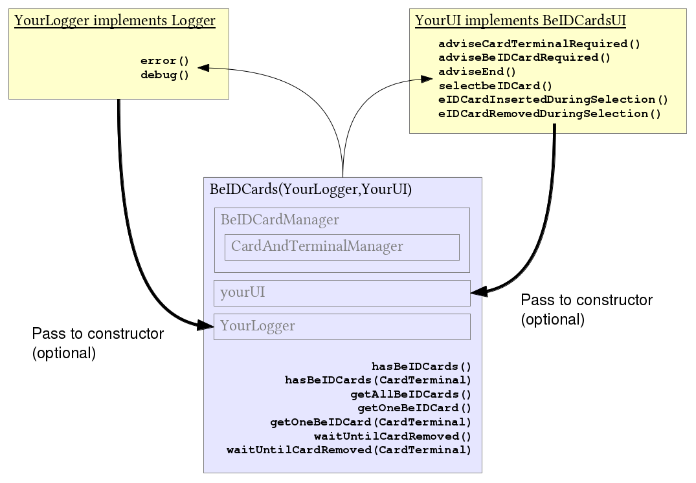
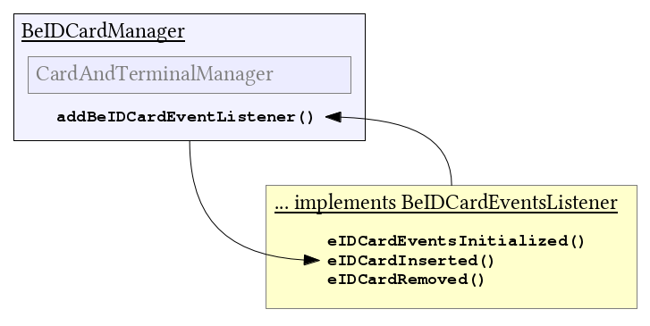
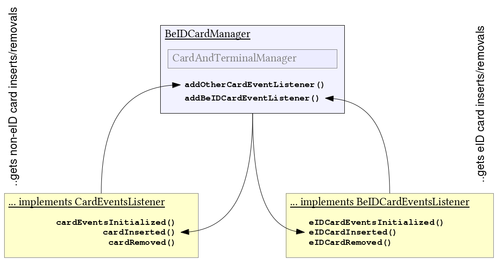
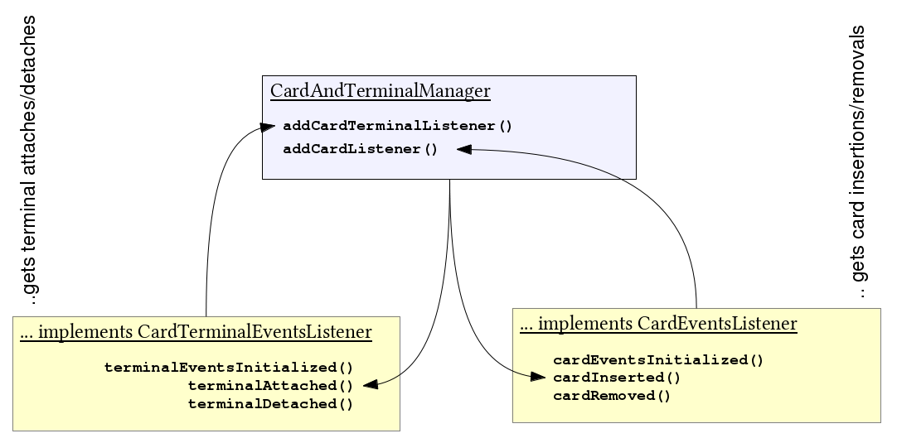
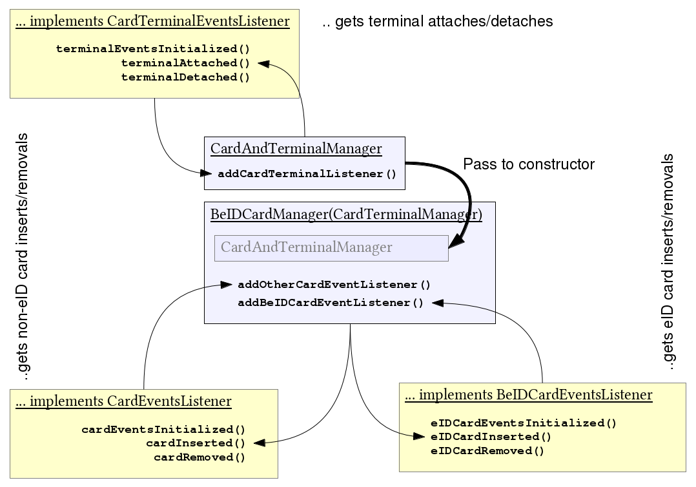

# Commons eID Client

This artifact holds the actual PC/SC based eID code.
It has no other dependencies so it can be used within lightweight components.

## Blocking until the user has inserted/removed their eID

Instantiate one BeIDCards object with the default constructor. 
Call its getOneBeIDCard() method.
This will block until a cardterminal is connected and an eID card has
been inserted into it, and then return a BeIDCard instance connected to
that eID card.

On a system with a graphical display, a DefaultBeIDCards UI will internally
be instantiated (if that class is on the classpath) and used to display dialogs if and when required.
For example, to ask the user to attach a card terminal if none is
attached, to insert an eID if none is present, or to choose from
several eID cards if several are present at time of call. 

Once you have obtained a BeIDCard object, the same BeIDCards instance
allows you to block waiting for the user to remove that eID card.

Several methods in BeIDCards take an optional argument "CardTerminal":
In situations with multiple card readers, this allows you to limit the
call to that particular card reader.

## Logging

Most classes in commons-eid take an optional Logger instance as a
constructor argument. It is recommended for all non-trivial applications,
to pass one's own Logger, and allow capture of such events, to allow diagnostics/debugging.  

## Custom User Interface for Blocking API

The BeIDCards constructor takes, apart from the ubiquitous Logger, a BeIDCardsUI argument.

Pass an instance implementing BeIDCardsUI to override the default
on-screen UI with whatever interface is appropriate to your application.
You might extend BeIDCardsUIAdapter to have less code clutter if you don't
need to implement all the methods. For example, if you're an embedded
application with one fixed card terminal, adviseCardTerminalRequired,
selectBeIDCard, etc.. will never be called, since there will always
be a card terminal and never more than one.

## Getting called when the user inserts/removes their eID

Steps:
* Instantiate a BeIDCardManager using the default constructor.
* Instantiate your implementation of BeIDCardEventsListener
* Call the BeIDCardManager's addBeIDCardListener, passing your BeIDCardEventsListener. 
* Call your BeIDCardManager's start() method.

Your BeIDCardListeners will get the following calls:
  * eIDCardInserted() for every eID Card present at time start() was called
  * eIDCardEventsInitialised, once
  * eIDCardInserted for every eID card subsequently inserted
  * eIDCardRemoved for every eID card subsequently removed

# Getting called when the user inserts/removes their eID or other Smart Cards

In the same way that you can register BeIDCardEventsListener instances
with a BeIDCardManager, you can also register CardEventsListener instances
using the BeIDCardEventsListener addOtherCardListener() method. The methods
of these instances will be called for insert/remove events of non-eID cards.	
You might use this to handle other card types or to alert the user about
non-supported card types.

The BeIDCardManager constructor takes 2 optional arguments: a Logger and
a CardAndTerminalManager.

Pass an instance implementing Logger to get all the
internal events involved in detecting cardterminals and cards. 
It is recommended for all non-trivial applications, to pass one's own Logger, and allow
capture of such events, to allow diagnostics/debugging. 

Pass an instance of CardAndTerminalManager for the BeIDCardManager to
use this instead of creating its own private instance. This is useful 
to get control of how and when terminals and cards are detected, or to
avoid 2 CardAndTerminalManagers having to be created if you also want
the notification of terminal attaches/detaches that CardAndTerminalManager
offers. See below.

# Getting called when the user attaches/detaches card terminals or inserts/removes Smart Cards

Instantiate a CardAndTerminalmanager using the default constructor,
register CardTerminalEventListeners to get terminal attach/detach
notifications, register CardEventListeners to get card insert/remove
notifications. Note that the latter will notify for any type of
smart cards, if you want to only detect BeID cards, consider
using a BeIDCardManager instead.

# Getting called for BeID and Other cards, and Terminal Attaches/Detaches

 

The patterns above may be combined to get separate notifications for:
* CardTerminals being attached/detached
* BeID Cards being inserted/removed
* Other smart cards being inserted/removed

Instantiate your own CardAndTerminalManager, pass it to your BeIDCardsManager's
constructor. Register CardTerminalEventListener instances with your
CardAndTerminalManager to get attach/detach events, BeIDCardEventsListeners and/or
CardEventsListeners with your BeIDCardsManager to get BeID insert/remove
and insert/remove events for other cards, resp. Call start() on your CardAndTerminalManager.
There is no need to start() the BeIDCardManager, in this case (it has no effect)

Note that CardEventsListeners may either be registered with a BeIDCardsManager
or with a CardAndTerminalManager. The difference being that those registered
with a CardAndTerminalManager will see events for all smart cards, BeID or not,
while those registered with a BeIDCardManager will only see events for non-BeID
cards (BeID cards being reported to BeIDCardListener instances)

# Example Code

The commons-eid-tests package has some example code snippets, in src/main/java
(the unit tests are in src/test/java).
